# Agents the Hard Way: 12-Factor Agents

## The Journey to 12-Factor Agents

We've been hacking on agents for a while.

These early experiments revealed significant challenges when deploying agent systems to production:

1. **Reliability issues**: Agents would get stuck in loops, hallucinate capabilities, or fail to make progress
2. **Debugging difficulties**: Tracing through chains of thought to find errors was nearly impossible
3. **Context management problems**: As conversations grew, agents would lose track of context and spin out into error loops, trying the same broken approach over and over again
4. **Framework limitations**: Existing frameworks struggled to find the right balance between productivity and flexibility. They either abstracted away too much into black boxes that were hard to customize, or became so flexible they offered little value over building from scratch. We found ourselves digging through layers of abstractions and prompt templates just to make minor improvements.

After testing multiple frameworks and encountering similar limitations with each, we recognized the need for a different approach. Instead of adapting frameworks to our requirements, we decided to build from first principles, focusing on:

- Clear separation between reasoning and action
- Maintainable code with familiar patterns
- Robust error handling
- Effective human oversight

This led to a simpler architecture: using LLMs to convert natural language to structured tool calls, then handling those tool calls with traditional programming patterns. Our first production system built on these principles was the Linear Assistant - an agent that helps teams manage their project workflows in Linear through email interactions. It was deliberately focused on a narrow domain, but within that domain, it was remarkably effective. What made this approach different was its simplicity. Instead of trying to be everything to everyone, it did one thing well. And instead of relying on complex frameworks, it used patterns familiar to any software developer.

We stripped everything back to basics. We defined clear interfaces between components. We separated reasoning from action. We built testable, maintainable systems that happened to use LLMs, rather than LLM systems that happened to be software.

Our first production system built on these principles was the Linear Assistant - an agent that helps teams manage their project workflows in Linear through email interactions. It was deliberately focused on a narrow domain, but within that domain, it was remarkably effective. What made this approach different was its simplicity. Instead of trying to be everything to everyone, it did one thing well. And instead of relying on complex frameworks, it used patterns familiar to any software developer.

As we built more agents using this approach, we began to see common patterns emerge. These patterns weren't specific to any particular domain or use case - they were fundamental principles for building robust agent systems. We codified these principles as the "12-Factor Agents" methodology, inspired by Heroku's influential 12-Factor App framework for building cloud-native applications.

- Breaking out of chat interfaces to build [outer loop agents](https://theouterloop.substack.com/p/openais-realtime-api-is-a-step-towards)
We codified these principles as the "12-Factor Agents" methodology, inspired by Heroku's influential 12-Factor App framework. Just as the original 12-Factor App methodology helped developers navigate the transition to cloud computing, we hope our 12-Factor Agents methodology will help teams build robust, maintainable AI agents that deliver real value in production environments.

## How We Got Here

Our journey to this approach wasn't straightforward. When we first started building AI agents in early 2023, we were captivated by the promise of fully autonomous systems. The viral success of AutoGPT had everyone imagining agents that could independently tackle complex tasks with minimal human oversight. We jumped on this bandwagon, experimenting with various frameworks that promised to deliver this autonomous future.

Our first attempts were built on top of LangChain, using its agent frameworks to create systems that could reason about tasks and execute them. While these worked well for demos and simple use cases, we quickly hit limitations when trying to deploy them in production:

1. **Reliability issues**: The agents would sometimes get stuck in loops, hallucinate capabilities, or simply fail to make progress. One agent confidently told a customer we offered a product that didn't exist, then proceeded to make up pricing details!
2. **Debugging nightmares**: When things went wrong, it was nearly impossible to understand why or how to fix it. Tracing through 50KB of nested JSON chains felt like archaeological work, not software engineering.
3. **Context window bloat**: As conversations grew longer, the agents would lose track of earlier context, spiraling into error loops trying the same thing over and over again. We watched in horror as one agent tried the same API call with the same parameters five times in a row, each time getting the same error.
4. **Lack of control**: The frameworks made too many decisions for us, leaving us unable to customize critical behaviors. We spent more time fighting the framework than building features.


Next, we tried other frameworks - each promising to solve the problems of the last. We experimented with CrewAI for multi-agent collaboration, AutoGen for more structured agent interactions, and even built our own mini-frameworks on top of these tools. While each framework had its strengths, they all shared a common weakness: they abstracted away too much of the underlying mechanics, making it difficult to build truly robust systems.

The breaking point came when we tried to implement a seemingly simple feature: having an agent remember the context of a conversation across multiple sessions. What should have been straightforward turned into a complex integration challenge that required hacking around the framework's assumptions. After three days of fighting with serialization issues and context management, we realized we were solving the wrong problem.

In late 2023, we decided to take a step back and reconsider our approach. Instead of starting with a framework and trying to bend it to our needs, what if we started with first principles and built exactly what we needed? We began by defining the core capabilities we wanted in our agents:
- Reliable execution of tasks
- Clear separation between reasoning and action
- Maintainable codebase that developers could understand
- Ability to handle errors gracefully
- Human oversight for critical operations

This led us to a much simpler architecture: use LLMs to convert natural language to structured tool calls, then use traditional programming patterns to handle those tool calls. No complex frameworks, no black-box reasoning - just clean interfaces between components.

Our first production system built on these principles was the Linear Assistant - an agent that helps teams manage their project workflows in Linear through email interactions. It was deliberately focused on a narrow domain, but within that domain, it was remarkably effective. What made this approach different was its simplicity. Instead of trying to be everything to everyone, it did one thing well. And instead of relying on complex frameworks, it used patterns familiar to any software developer.

As we built more agents using this approach, we began to see common patterns emerge. These patterns weren't specific to any particular domain or use case - they were fundamental principles for building robust agent systems. We codified these principles as the "12-Factor Agents" methodology, inspired by Heroku's influential 12-Factor App framework for building cloud-native applications.

## Our Example: The Linear Assistant

Throughout this article, we'll reference a real-world agent we've built: the Linear Assistant. This agent helps teams manage their project workflows in Linear (a project management tool) through natural language interactions via email. Users can email the assistant to create issues, add comments, update statuses, and more.

The Linear Assistant demonstrates all 12 factors in action:
- It processes natural language emails and converts them to structured tool calls
- It maintains context across multiple interactions
- It handles errors gracefully and adapts its approach
- It knows when to ask humans for clarification or approval
- It can be triggered from various channels (primarily email)


With this example in mind, let's dive into the 12 factors that define our methodology.

## 1. Natural Language → Tool Calls

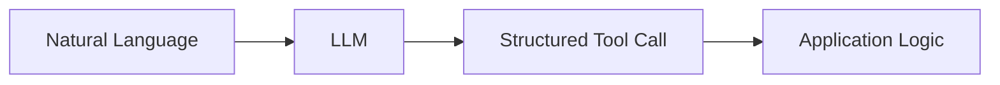

At the core of our approach is a simple pattern: convert natural language to structured tool calls. Instead of building complex chains of prompts and hoping for the best, we focus on teaching our LLMs to output structured data that our systems can reliably act upon.

```typescript
// The LLM takes natural language and returns a structured tool call
const nextStep = await b.DetermineNextStep("make an issue for austin to stock the fridges")

// Handle the structured output based on its intent
switch (nextStep.intent) {
  case 'create_issue':
    // Code to create an issue
    break;
  case 'request_more_information':
    // Code to ask the user for more info
    break;
}
```

This pattern creates a clean interface between the LLM's reasoning and your application logic. It makes your code more maintainable, easier to test, and simpler to extend with new capabilities. When the LLM's output is structured, you can validate it before execution, preventing many common failure modes.

## 2. Small, Focused Agents

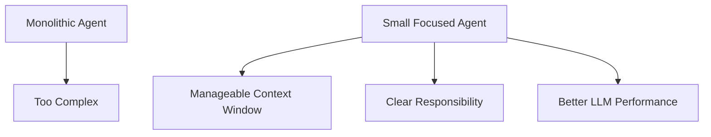

Rather than building monolithic agents that try to do everything, build small, focused agents that do one thing well. Each agent should have a clear responsibility boundary.

The key insight here is about LLM limitations: the bigger and more complex a task is, the more steps it will take, which means a longer context window. As context grows, LLMs are more likely to get lost or lose focus! By keeping agents focused on specific domains, we keep context windows manageable and LLM performance high.

Our Linear Assistant handles email-based issue management in Linear. It doesn't try to also manage GitHub issues, calendar scheduling, or data analysis. This focus allows it to excel at its specific task.

We learned this lesson the hard way when we initially tried to build a "super agent" that could handle multiple tools and workflows. The agent would frequently confuse which API to use for which task and lose track of multi-step processes. By splitting this into focused agents with clear responsibilities, reliability improved dramatically.

## 3. Compact Errors into Context Window

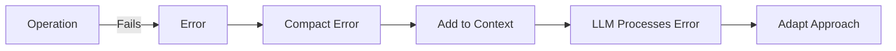

When something goes wrong, don't hide it from your agent. Compact the error information and include it in the context window:

```typescript
try {
  // Operation that might fail
} catch (e) {
  console.error(e)
  thread.events.push({
    type: 'error',
    data: `error running ${thread.events.slice(-1)[0].type}: ${e}`,
  })
  
  // Feed the error back to the LLM
  const nextStep = await b.DetermineNextStep(threadToPrompt(thread))
  // Continue processing with awareness of the error
}
```

This allows your agent to learn from mistakes and adapt its approach in real-time, just like a human would. In practice, this approach has been transformative. When our Linear Assistant encounters an error like "Invalid team ID format," it doesn't just fail – it recognizes the error, lists available teams, and tries again with the correct ID. Users often don't even realize an error occurred because the agent recovered so seamlessly.

## 4. Use Tools for Human Interaction

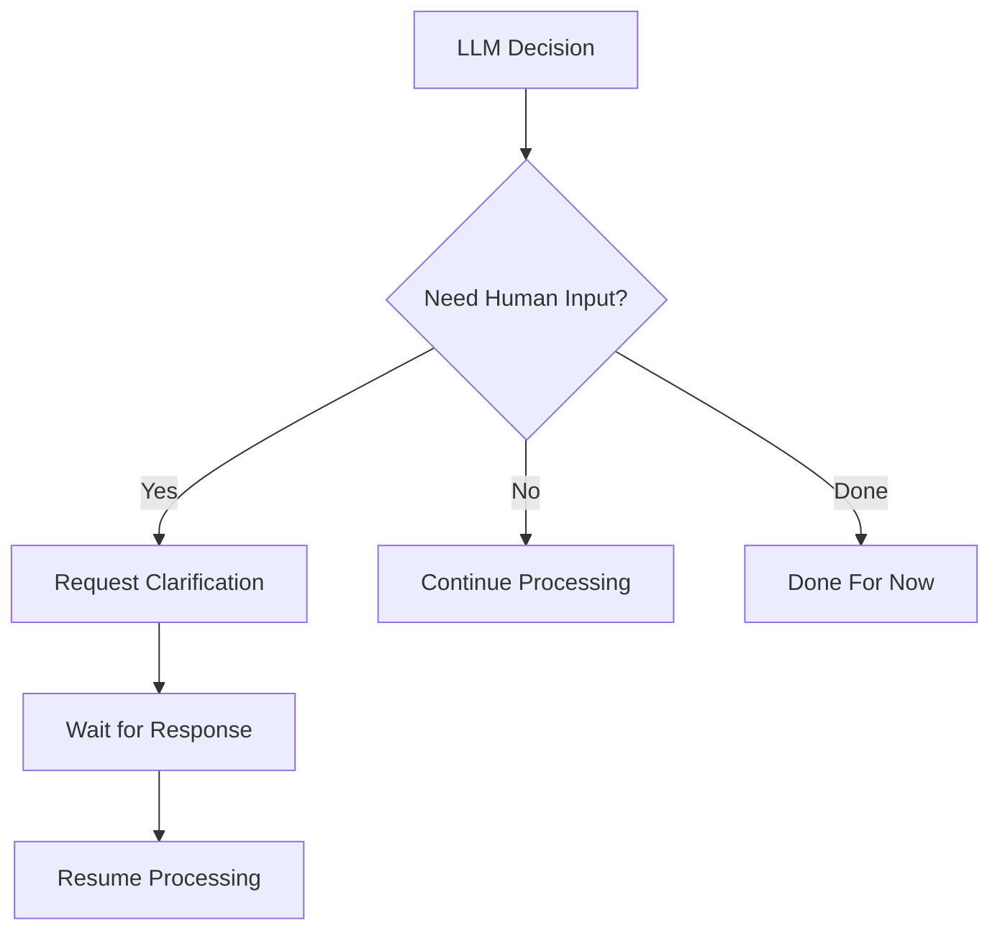

Human interaction should be treated as just another tool call. By modeling human input requests as structured outputs, you create a uniform pattern throughout your codebase:

```typescript
// Tool definitions for human interaction
class RequestClarification {
  intent: "request_clarification"
  question: string
  context: string
}

class DoneForNow {
  intent: "done_for_now"
  message: string
  summary: string
}
```

This approach gives the LLM specific options for how and when to contact humans, with clear structures for what information to include, rather than generic "text OR json" outputs that are common in chat interfaces.

By treating human interaction as a first-class concept in your agent architecture, you make it easier to build systems that know when to operate autonomously and when to involve humans. This creates a more natural collaboration between humans and AI, where each contributes their strengths.

## 5. Tools Are Just Structured Output

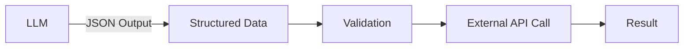

Tools don't need to be complex. At their core, they're just structured output from your LLM that triggers deterministic code:

```baml
class CreateIssue {
  intent: "create_issue"
  issue: {
    title: string
    description: string
    team_id: string
    assignee_id: string
  }
}

class SearchIssues {
  intent: "search_issues"
  query: string
}
```

The pattern is simple:
1. LLM outputs structured JSON
2. Your code validates the structure
3. Deterministic code executes the appropriate action (like calling an external API)
4. Results are captured and fed back into the context

This creates a clean separation between the LLM's decision-making and your application's actions. The LLM decides what to do, but your code controls how it's done. This separation makes your system more reliable and easier to debug when things go wrong.

## 6. Own Your Prompts

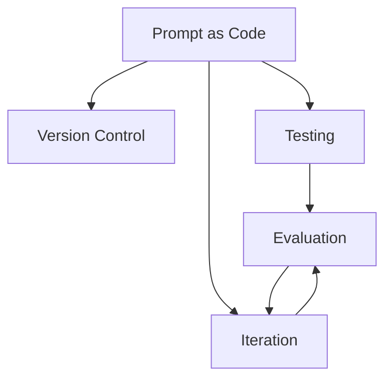

Don't outsource your prompt engineering to a framework. Own your prompts and treat them as first-class citizens in your codebase:

```baml
function DetermineNextStep(thread: string) -> /* various tool types */ {
    client CustomGPT4o

    prompt #"
        {{ _.role("system") }}

        You are a helpful assistant that helps the user with their linear issue management.
        You work hard for whoever sent the inbound initial email, and want to do your best
        to help them do their job by carrying out tasks against the linear api.

        // ... rest of prompt ...

        {{ _.role("user") }}

        // ... user-specific instructions ...

        {{ thread }}

        What should the next step be?

        {{ ctx.output_format }}
    "#
}
```

By maintaining direct control over your prompts, you can:
1. Version control them alongside your code
2. Test them with specific examples
3. Iterate based on real-world performance

Testing is particularly powerful with this approach:

```baml
test TeamIDErrorAsksForMoreInput {
  functions [DetermineNextStep]
  args {
    thread #"
      
          Events:
              <email_received>:
                  {"from_address":"test@example.com","to_address":"support@company.com","subject":"New Ticket","body":"Can you make a new issue for Austin to restock the fridges with tasty beers?","message_id":"test123","previous_thread":[],"raw_email":"raw email content","is_test":null}
              </email_received>
              
      <create_issue> 
                  Title: Restock fridges with tasty beers
                  Description: Austin is requested to restock the fridges with tasty beers.
                  Team ID: team_supply_maintenance
              </create_issue>
              
      <issue_create_result>: 
                  {"errors": [{"message": "Argument Validation Error", "path": ["issueCreate"], "locations": [{"line": 3, "column": 13}], "extensions": {"code": "INVALID_INPUT", "type": "invalid input", "userError": true, "userPresentableMessage": "teamId must be a UUID.", "meta": {}}}], "data: null}"
              </issue_create_result>
              
          
    "#
  }
  @@assert({{this.intent == "list_teams"}})
}
```

This allows you to verify that your agent behaves as expected in specific scenarios. By writing tests for your prompts, you can catch regressions before they affect users and systematically improve your agent's behavior over time.

## 7. Own How You Build Context

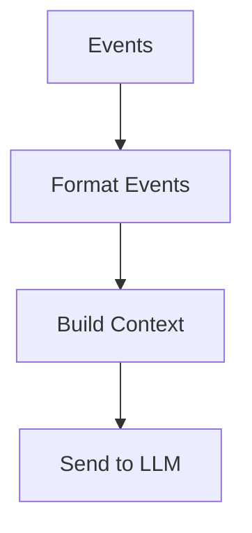

Don't be constrained by the standard message-based context building of most frameworks. Build your context however makes sense for your application.

### Standard OpenAI Message Format

Most frameworks use the OpenAI message format, which looks like this:

```json
[
  {
    "role": "system",
    "content": "You are a helpful assistant that helps users manage their Linear issues."
  },
  {
    "role": "user",
    "content": "Can you create an issue for Austin to restock the fridges?"
  },
  {
    "role": "assistant",
    "content": "I'll help you create that issue. Could you tell me which team this should be assigned to?"
  },
  {
    "role": "user",
    "content": "The Operations team"
  },
  {
    "role": "assistant",
    "content": "Thanks! I'll create an issue for Austin to restock the fridges in the Operations team."
  }
]
```

When tool calls are involved, the format becomes even more complex:

```json
[
  {
    "role": "system",
    "content": "You are a helpful assistant that helps users manage their Linear issues."
  },
  {
    "role": "user",
    "content": "Can you create an issue for Austin to restock the fridges?"
  },
  {
    "role": "assistant",
    "content": null,
    "function_call": {
      "name": "list_teams",
      "arguments": "{}"
    }
  },
  {
    "role": "function",
    "name": "list_teams",
    "content": "{\"teams\": [{\"id\": \"team-123\", \"name\": \"Operations\", \"members\": [{\"id\": \"user-456\", \"name\": \"Austin\"}]}]}"
  },
  {
    "role": "assistant",
    "content": "I'll create an issue for Austin to restock the fridges in the Operations team."
  }
]
```

This format works well for simple chat applications, but it has limitations for complex agents:
- It's difficult to include structured data
- It's hard to represent tool calls and their results
- It's challenging to maintain context across multiple interactions
- It's not optimized for error handling and recovery

### Custom Context Format

Instead, we can build our own context format that's optimized for our specific use case:

```typescript
const eventToPrompt = (event: Event) => {
  switch (event.type) {
    case 'email_received':
      const email = event.data as EmailPayload
      return `<${event.type}>
            From: ${email.from_address}
            To: ${email.to_address}
            Subject: ${email.subject}
            Body: ${email.body}
            Previous Thread: ${stringifyToYaml(email.previous_thread)}
</${event.type}>
        `
    default:
      const data = typeof event.data !== 'string' ? stringifyToYaml(event.data) : event.data
      return `<${event.type}>
          ${data}
</${event.type}>
      `
  }
}

const threadToPrompt = (thread: Thread) => {
  return thread.events.map(eventToPrompt).join('\n\n')
}
```

This approach gives you complete control over the information density and format of your context window.

### Example Context Windows

Here are some examples of how context windows might look with this approach:

**Example 1: Initial Email Request**
```
<email_received>
    From: user@example.com
    To: linear-assistant@company.com
    Subject: Create issue for restocking
    Body: Can you please create an issue for Austin to restock the fridges with drinks? It's getting empty.
    Previous Thread: []
</email_received>
```

**Example 2: After Listing Teams**
```
<email_received>
    From: user@example.com
    To: linear-assistant@company.com
    Subject: Create issue for restocking
    Body: Can you please create an issue for Austin to restock the fridges with drinks? It's getting empty.
    Previous Thread: []
</email_received>

<list_teams>
    intent: "list_teams"
</list_teams>

<list_teams_result>
    data:
      teams:
        nodes:
          - id: "team-123"
            name: "Operations"
            members:
              nodes:
                - id: "user-456"
                  name: "Austin"
                - id: "user-789"
                  name: "Sarah"
</list_teams_result>
```

**Example 3: After Error and Recovery**
```
<email_received>
    From: user@example.com
    To: linear-assistant@company.com
    Subject: Create issue for restocking
    Body: Can you please create an issue for Austin to restock the fridges with drinks? It's getting empty.
    Previous Thread: []
</email_received>

<create_issue>
    intent: "create_issue"
    issue:
      title: "Restock fridges with drinks"
      description: "The fridges are getting empty and need to be restocked with drinks."
      team_id: "wrong-id"
      assignee_id: "user-456"
</create_issue>

<error>
    error running create_issue: Invalid team ID format
</error>

<list_teams>
    intent: "list_teams"
</list_teams>

<list_teams_result>
    data:
      teams:
        nodes:
          - id: "team-123"
            name: "Operations"
            members:
              nodes:
                - id: "user-456"
                  name: "Austin"
                - id: "user-789"
                  name: "Sarah"
</list_teams_result>

<create_issue>
    intent: "create_issue"
    issue:
      title: "Restock fridges with drinks"
      description: "The fridges are getting empty and need to be restocked with drinks."
      team_id: "team-123"
      assignee_id: "user-456"
</create_issue>

<issue_create_result>
    data:
      issueCreate:
        success: true
        issue:
          id: "issue-001"
          title: "Restock fridges with drinks"
          url: "https://linear.app/company/issue/OPS-42"
</issue_create_result>
```

**Example 4: Human Interaction**
```
<email_received>
    From: user@example.com
    To: linear-assistant@company.com
    Subject: Create issue for project
    Body: Can you create an issue for the new project?
    Previous Thread: []
</email_received>

<request_more_information>
    intent: "request_more_information"
    message: "I'd be happy to create an issue for the new project. Could you please provide more details about what the issue should contain? For example, what's the title, description, and who should be assigned to it?"
</request_more_information>

<human_response>
    message: "The issue should be titled 'Set up new marketing project', assigned to Sarah, with description 'Initialize the new Q3 marketing campaign project with initial tasks and timeline'."
</human_response>

<list_users>
    intent: "list_users"
</list_users>

<list_users_result>
    data:
      users:
        nodes:
          - id: "user-789"
            name: "Sarah"
            email: "sarah@company.com"
          - id: "user-456"
            name: "Austin"
            email: "austin@company.com"
</list_users_result>
```

By structuring context in this XML-like format, we make it easy for the LLM to understand the history of interactions and make informed decisions about what to do next. This approach is much more flexible than the standard chat format used by most frameworks.

## 8. Own Your Control Flow

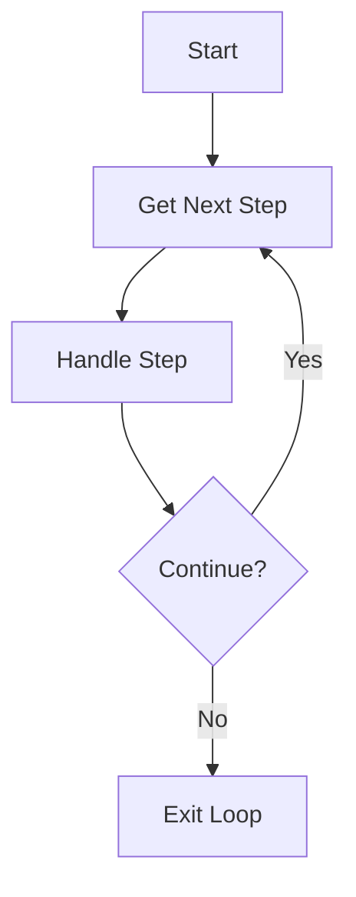

Don't let frameworks dictate your application's flow. Build your own control structures that make sense for your specific use case:

```typescript
const handleNextStep = async (thread: Thread): Promise<void> => {
  let nextThread: Thread | false = thread

  while (true) {
    const nextStep = await b.DetermineNextStep(threadToPrompt(nextThread))
    
    nextThread = await _handleNextStep(thread, nextStep)
    if (!nextThread) {
      break  // Exit when we need human input or the task is complete
    }
  }
}
```

This pattern allows you to interrupt and resume your agent's flow as needed, creating more natural conversations and workflows.

## 9. Simplify with Context Window State

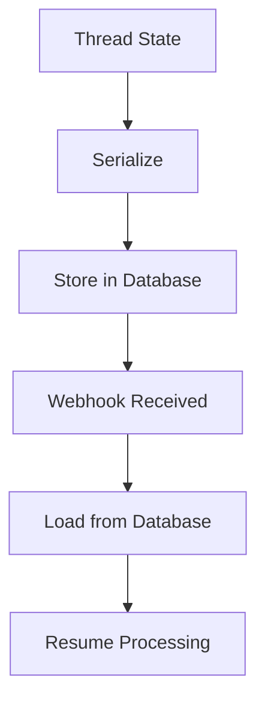

Keep your state management simple by storing all state in a serializable thread object:

```typescript
// Append events to the thread
thread.events.push({
  type: 'create_issue',
  data: nextStep,
})

// Serialize and save state to database
const threadId = await db.saveThread(thread)

// In webhook handler, load state and resume
const handleWebhook = async (req: Request, res: Response) => {
  const { threadId, response } = req.body
  
  // Load thread state from database
  const thread = await db.getThread(threadId)
  
  // Add the human response to the thread
  thread.events.push({
    type: 'human_response',
    data: response,
  })
  
  // Resume processing
  await handleNextStep(thread)
}
```

This approach makes your agent stateless between requests, improving reliability and scalability.

## 10. APIs to Kick Off and Resume Agents

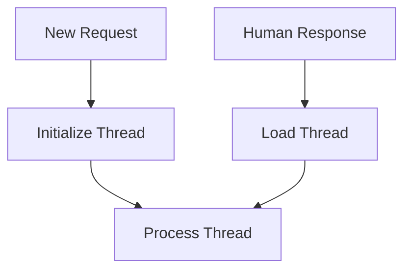

Design clear APIs for starting new agent threads and resuming existing ones:

```typescript
// New email handler to start a thread
const newEmailThreadHandler = async (payload: EmailWebhookPayload, res: Response) => {
  // Initialize a new thread
  let thread: Thread = {
    initial_email: payload.event,
    events: [
      {
        type: 'email_received',
        data: payload.event,
      },
    ],
  }
  
  // Start processing
  await handleNextStep(thread)
}

// Handler for human responses to resume a thread
const handleHumanResponse = async (thread: Thread, response: string): Promise<void> => {
  // Add the human response to the thread
  thread.events.push({
    type: 'human_response',
    data: response,
  })
  
  // Continue processing from where we left off
  await handleNextStep(thread)
}
```

These APIs create clean boundaries for thread lifecycle management.

## 11. Trigger Agents from Anywhere

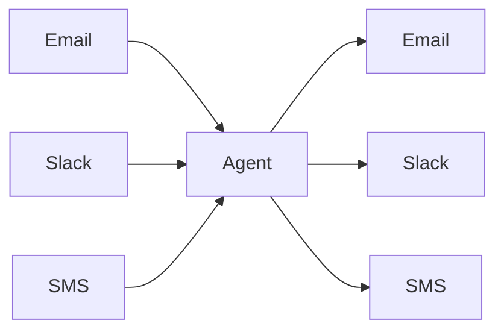

Meet users where they are by designing your agents to be triggered from various channels. This flexibility allows your agents to integrate seamlessly with email, Slack, SMS, or any other communication channel.

The key is to abstract the input and output channels from the core agent logic, allowing the same agent to be triggered from and respond through multiple channels.

## 12. Make Your Agent a Stateless Reducer

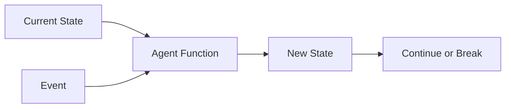

Design your agent as a stateless reducer that takes the current state and an event, then returns a new state:

```typescript
// The agent is a pure function: (state, event) => new state
const _handleNextStep = async (
  thread: Thread,  // Current state
  nextStep: Action,  // Event
): Promise<Thread | false> => {
  // Create a new state based on the current state and event
  switch (nextStep.intent) {
    case 'list_teams':
      thread.events.push({
        type: 'list_teams',
        data: nextStep,
      })
      thread = await appendResult(thread, () => linearClient.teams(), 'teams')
      return thread
    case 'request_clarification':
      thread.events.push({
        type: 'request_clarification',
        data: nextStep,
      })
      // Save state and wait for human input
      await db.saveThread(thread)
      return false
    // ... other cases
  }
}

// The overall pattern is:
// 1. Prompt (DetermineNextStep)
// 2. Switch (handle the intent)
// 3. Loop or Break (continue processing or wait for input)
```

This functional approach makes your agent easier to test, debug, and scale.

## Bringing It All Together

By following these 12 factors, we've built agents that are robust, maintainable, and effective at solving real business problems. The Linear Assistant we've created can:

1. Receive emails requesting Linear issue creation or updates
2. Parse and understand complex natural language requests
3. Take appropriate actions through the Linear API
4. Request human approval for sensitive operations
5. Ask for clarification when needed
6. Maintain context across multiple interactions
7. Respond naturally to users via email

And it does all this through a simple, clear architecture that our team can easily maintain and extend.

## Conclusion

Building agents "the hard way" might seem like more work initially, but the benefits are substantial. You gain complete control over your agent's behavior, eliminating the black-box problems that plague many framework-based approaches.

The 12-Factor Agent methodology creates a clear separation of concerns:
- LLMs handle natural language understanding and decision-making
- Your code handles structured actions and external integrations
- Humans provide oversight and handle edge cases

This separation allows each part of the system to do what it does best, creating agents that are truly useful rather than merely impressive demos.

As we look to the future, we see these principles becoming even more important. As LLM capabilities continue to advance, the bottleneck in agent development will shift from "can the model understand this task?" to "can we build reliable systems around these models?" The teams that master these engineering challenges will be the ones that successfully deploy AI agents that create lasting business value.

Whether you're building customer service agents, internal tools, or complex workflow automation, the 12-Factor approach provides a solid foundation that will scale with both your ambitions and the rapidly evolving capabilities of foundation models.
